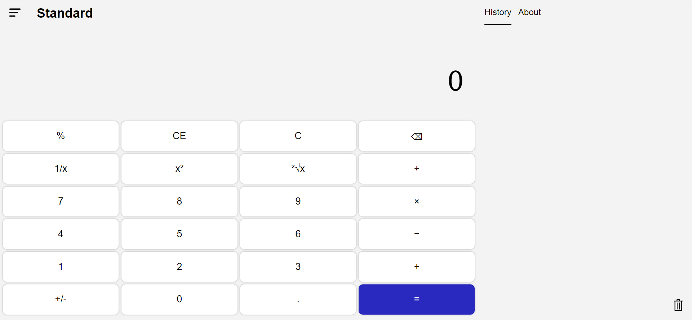
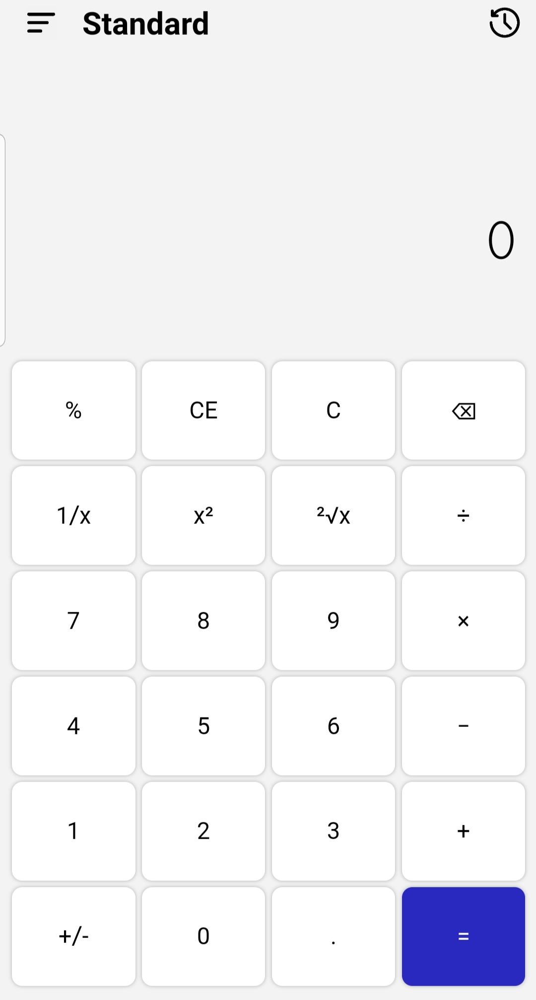

# Windows Calculator Clone

## A functioning windows calculator (partial) clone

This is the final project in [The Odin Project's](https://www.theodinproject.com/dashboard) Foundations path. The project features:

* Responsive design (designed to look good on both computers and mobiles).
* Basic (addition, multiplication, ...) and special operations (absolute value, negation, square root, exponents, ....).
* Standard and Scientific modes.
* Integers and Floats.
* Brackets (any operation written inside brackets will follow order precedence).
* Automating the correction of incomplete user inputs.
* History log, which can be used to retrieve past history via clicking.
* Keyboard support for numbers and most operations.

This calculator is a clone of the standard and scientific layouts of the windows calculator (excluding some features like trigonometry and custom functions). 

## Demo

Check the demo [here](https://mathoverse100.github.io/odin-calculator/).

## Screenshots

## How to improve

I made this project when I was just starting to learn Web Development, so my code is probably very long and not great. Therefore, working on making the code more readable, concise and fixing the logic is important.

Many features are also missing for it to be a proper clone. I'm not sure if I'll come back to this project and make it better, but be free to clone this repository and make your own changes however you prefer.

## Potential Issues

One very big issue is that the calculator cannot parse large numbers properly, which is not very great for a scientific calculator. That said, it works on numbers up to 16 digits (18 including decimal numbers), which is good for most purposes. 

If someone can fix this issue, please feel free to contribute by following these steps:

1. Fork the repository.
2. Clone your forked repository to your local machine.
3. Create a new branch for your feature or fix.
4. Make the necessary changes and commit them.
5. Push your changes to your forked repository.
6. Open a pull request to the main repository.

Your contributions are greatly appreciated!

## License

MIT License

Copyright (c) 2020 The Odin Project

Permission is hereby granted, free of charge, to any person obtaining a copy
of this software and associated documentation files (the "Software"), to deal
in the Software without restriction, including without limitation the rights
to use, copy, modify, merge, publish, distribute, sublicense, and/or sell
copies of the Software, and to permit persons to whom the Software is
furnished to do so, subject to the following conditions:

The above copyright notice and this permission notice shall be included in all
copies or substantial portions of the Software.

THE SOFTWARE IS PROVIDED "AS IS", WITHOUT WARRANTY OF ANY KIND, EXPRESS OR
IMPLIED, INCLUDING BUT NOT LIMITED TO THE WARRANTIES OF MERCHANTABILITY,
FITNESS FOR A PARTICULAR PURPOSE AND NONINFRINGEMENT. IN NO EVENT SHALL THE
AUTHORS OR COPYRIGHT HOLDERS BE LIABLE FOR ANY CLAIM, DAMAGES OR OTHER
LIABILITY, WHETHER IN AN ACTION OF CONTRACT, TORT OR OTHERWISE, ARISING FROM,
OUT OF OR IN CONNECTION WITH THE SOFTWARE OR THE USE OR OTHER DEALINGS IN THE
SOFTWARE.
